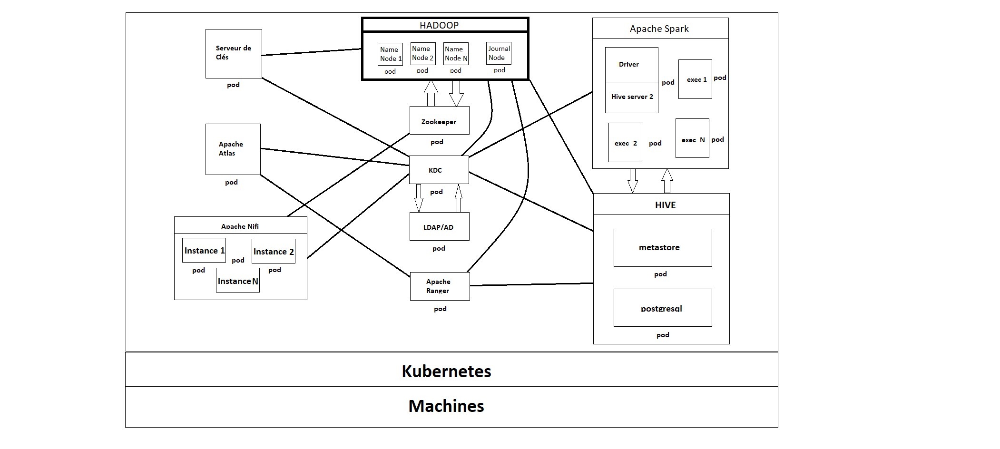

# Helm Chart for platform-labp7

platform-labp7 est une plateforme big data performante et sécurisée.

## Introduction

platform-labp7 presente une platforme complete pour processer,stocker et secureser les données
la plateforme repose sur ces techniques pour réaliser ces tâches:
 - spark thrift: moteur de calcul
 - hdfs: stockage distribué des données
 - kerberos: gestion d'authentifications des utilisateurs
 - apache: ranger: gestion des autorisations des utilisateurs
 - apache: ranger kms: gestion des clés de cryptage des données
 - hive metastore: gestion des schemas sql.
 - postgresql: stockage physique des metadonnées de hive
 - ldap: toDo 

 ### Architecture
 


## Conditions préalables

- il faut un cluster kube pour installer la plateforme avec un master et un worker (minimum)
- Helm version 3.0.0 ou plus
- la platforme a besoin du kerberos client avant de commencer l'installation:
    - centos: `yum install krb5-workstation krb5-libs`
    - ubuntu: `apt install krb5-user` 


## Installation du Chart

Pour installer le chart, utilisez la commande suivante:
`charts\platform-labp7\start.sh ns-name`
l'installation peut prendre un peu de temps finalement il faut avoir une liste de pod comme celle-ci:

|NAME                                            |READY   |STATUS    |RESTARTS          |AGE |
|------------------------------------------------|--------|----------|------------------|----|
|platform-labp7-hdfs-client-557d579b95-jhp7f     |1/1     |Running   |0                 |2d3h|
|platform-labp7-hdfs-datanode-rmg8p              |1/1     |Running   |0                 |2d3h|
|platform-labp7-hdfs-datanode-znnrm              |1/1     |Running   |4 (5m44s ago)     |2d3h|
|platform-labp7-hdfs-krb5-0                      |1/1     |Running   |0                 |2d3h|
|platform-labp7-hdfs-namenode-0                  |1/1     |Running   |4 (2d2h ago)      |2d3h|
|platform-labp7-postgresql-0                     |1/1     |Running   |1 (2d3h ago)      |2d3h|
|platform-labp7-ranger-admin-0                   |1/1     |Running   |0                 |2d2h|
|platform-labp7-ranger-kms-0                     |1/1     |Running   |0                 |26h |
|platform-labp7-spark-0                          |1/1     |Running   |0                 |2d2h|
|sparksql-10-244-1-149-f3e4ef876f92a9ca-exec-1   |1/1     |Running   |0                 |2d2h|
|sparksql-10-244-1-149-f3e4ef876f92a9ca-exec-2   |1/1     |Running   |0                 |2d2h|
|sparksql-10-244-1-149-f3e4ef876f92a9ca-exec-3   |1/1     |Running   |0                 |2d2h|

## Configuration

The following table lists the configurable parameters of the chart and their default values.

| Parameter | Description | Default |
|-----------|-------------|---------|
| `parameter1` | Description of parameter1 | `default_value1` |
| `parameter2` | Description of parameter2 | `default_value2` |

[Include any additional configuration instructions, such as how to override default values or use custom configuration files.]

## Usage
### Configuration de la machine client

1. Installation MIT Kerberos Ticket Manager: <https://web.mit.edu/kerberos/dist/>
2. Rucuperation d'un ticket Kerberos en utilisant les login/password de l'utilisateur
3. En utilisant un ide de base données (ex: dbeaver) on ca configurer la connection avec spark thrift 
    - type de connection: URL
    - url: jdbc:hive2://(nom ou ip machine kube):30527/default;principal=hive/platform-labp7-spark-0.platform-labp7-spark.test.svc. cluster.local@LABP7.CNAM
4. C:\ProgramData\MIT\Kerberos5\krb5.ini
```
   [libdefaults]
   dns_lookup_realm = false
   ticket_lifetime = 24h
   renew_lifetime = 7d
   forwardable = true
   rdns = false
   default_realm = LABP7.CNAM
 
   [realms]
    LABP7.CNAM = {
    kdc = ip_adresse_kube:30226
    admin_server = ip_adresse_kube:30226
    }
    
```
5. C:\Users\user\AppData\Local\DBeaver\jaas.conf
```
   com.sun.security.jgss.initiate {
   com.sun.security.auth.module.Krb5LoginModule required
   debug=true
   doNotPrompt=true
   useKeyTab=true
   keyTab="C:/kerberos_cache/krb5cache"
   useTicketCache=true
   principal="login introduit dans mit";
   };
    
```

### urls des interfaces web

- url spark ui: <http://ip_adresse_kube:30526/>
- url hdfs ui: <http://ip_adresse_namenode:9870/dfshealth.html#tab-datanode>
- url ranger admin: <http://ip_adresse_kube:30523/login.jsp>


## Désinstaller le chart

Pour désinstaller/supprimer le chart, utilisez la commande suivante :
`charts\platform-labp7\start.sh ns-name`

La commande supprime tous les composants Kubernetes associés a le chart et supprime la version.

## Troubleshooting

#### commandes utiles:
- `kubectl get po -n ns_name` : pour vérifier le statut des pod (running sinon il y a un problème)
- `kubectl describe po po_name -n ns_name` : Utile pour récupérer des informations sur le pod et l'historique de ces états
- `kubectl logs po_name -n ns_name` : cette commande permet de récupérer les logs du pod en problème.
- `kubectl exec -it po_name -n ns_name --/bin/sh (ou /bin/bash)` : cette commande permet de se connecter sur le pod pour des opérations de débuggage plus poussées

## Contribuer

git url: <https://github.com/Talan-Lab-P7/platform-labp7.git>

## Licence

CNAM
